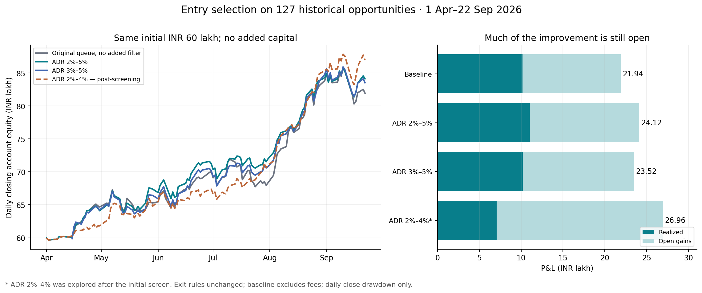

# Why 86 entries were skipped, and whether filters can improve selection

Research dated 27 September 2026. **Yes: lagged ADR filters improve the marked historical result with the same ₹60L limit. The strongest first-screen result is ₹24.12L at ADR 2%–5%; a later, explicitly post-screening 2%–4% test reaches ₹26.96L. Neither is a verified future return.** The tighter rule's increase is entirely driven by a larger open-profit component: realized profit falls to ₹7.07L.

This research changes no production code, parameters, trades or deployments. It studies admission to the previously verified historical entry stream. It does not run the complete current production scanner.

## Why the original 86 were skipped

There were 127 opportunities, 41 accepted lots and 86 capacity rejections. The simulator records **76 `slots` and 10 `cash`** because it tests the twelve-slot limit first. Reconstructing both conditions shows that **all 76 slot rejections also lacked enough cash**. The remaining ten had a spare slot but insufficient cash for the calculated whole lot. These were not quality-filter failures.

By 15 April, the original queue had filled all twelve slots, spending ₹59,97,018.39 and leaving only ₹2,981.61. It still held those same twelve lots when LAURUSLABS arrived on 23 April and CPPLUS on 5 May. That is why later desirable entries could not be added. In another example, KIRLOSENG on 15 May had eleven occupied slots and about ₹4.93L free, but the backtest required its calculated almost-₹5L lot; it does not automatically reduce quantity to the remaining cash.

The skips were concentrated early: April 40, May 27, June 2, July 5, August 9, September 3. Under the same standalone exits, 29 skipped opportunities finish positive and 57 negative. The 86 standalone outcomes sum to ₹7.71L, but that is **unfunded**, includes overlapping repeated stocks, and cannot be added to the baseline while claiming the ₹60L constraint.

Any workable filter must apply to **every incoming opportunity**, freeing cash before future winners arrive. It cannot see those future winners or cherry-pick the profitable 29. The complete before-entry cash and holdings for each decision are in [baseline-decisions.csv](baseline-decisions.csv).

## Portfolio results, with the exits held fixed

| Entry rule | P&L | Change | Realized | Open gains | Taken | Daily-close max drawdown |
| --- | ---: | ---: | ---: | ---: | ---: | ---: |
| Original queue, no added filter | ₹21.94L | — | ₹10.18L | ₹11.76L | 41 | 6.26% |
| ADR 2%–5% | ₹24.12L | +₹2.18L | ₹11.06L | ₹13.06L | 34 | 5.07% |
| ADR ≤5% | ₹24.04L | +₹2.10L | ₹11.06L | ₹12.98L | 36 | 5.25% |
| ADR 3%–5% | ₹23.52L | +₹1.59L | ₹10.20L | ₹13.32L | 33 | 5.21% |
| Least MA20 extension first | ₹22.97L | +₹1.03L | ₹11.21L | ₹11.76L | 40 | 6.19% |
| ADR 2%–4% — post-screening | ₹26.96L | +₹5.02L | ₹7.07L | ₹19.89L | 25 | 5.24% |




All results start with ₹60L, use at most twelve simultaneous lots and ₹5L purchase cost per lot, and retain ₹40k initial structural risk sizing. No capital is added. The unchanged winning exit policy is: initial structural stop 8% below entry; disaster protection at 95% of that structural stop; close breach exits at the next open; ratchet to 97% of the 20 post-entry closes once available; no breakeven, target or eight-week hold. Entry-session exclusion, the historical entry prices and the September 22 terminal mark remain unchanged. Closed sales include 0.5% slippage; this headline table excludes other fees and terminal liquidation costs.

Results count repeated entries as separate lots, including multiple positions in the same stock. They are not annualized returns. Drawdown uses daily closing equity and does not capture worse intraday drawdown. Realized and open columns must be distinguished.

The first screen contained **59 declared simple policies**, covering ADR, trend, momentum, relative strength versus NIFTYBEES, proximity to highs, extension, turnover, prior volume, dry-up, ETFs, duplicate positions and same-date ranking. The 2%–5% rule won that screen. Subsequent neighboring thresholds and combinations are saved separately as post-screening diagnostics; 2%–4% was discovered in those follow-ups. This sequence is explicit so that a later maximum is not presented as a rule chosen beforehand.

## The actual filters

For an entry on date D, use only the **twenty completed trading sessions strictly before D**:

```text
ADR20 = 100 × mean((session_high − session_low) / session_close)

Candidate A: require 2 ≤ ADR20 ≤ 5
Candidate B: require 2 ≤ ADR20 ≤ 4     # explored after the initial screen
```

Both bounds are inclusive. Require twenty valid bars; reject when this feature is unavailable. Retain original arrival order for the primary ADR tests. This is the average high-low range divided by close, **not ATR**, not a close-to-close change proxy, and not the entry day's completed range. GSPCROP and RSL have fewer than twenty prior sessions and are rejected by these rules; the baseline retains them. A history-only rejection makes ₹15.29L, so the ADR result is not simply an IPO-history exclusion.

The broad result is driven more by the upper edge than the precise lower edge: **ADR ≤5% alone makes ₹24.04L**, only about ₹8,040 below 2%–5%. There is little evidence here that a precisely 2% floor is essential. A 3%–5% band makes ₹23.52L. The production snapshot already configured `entry.adr_min_pct=3` and `entry.adr_max_pct=5`; the ₹21.94L winning exit backtest did not impose that entry gate. Testing one gate on the old book does not reproduce all the other production entry requirements.

A separate ranking rule sorts candidates available on the same date by ascending `100 × (prior_close / prior_SMA20 − 1)`, missing values last, and keeps the existing cash and slot checks. It returns ₹22.97L, but is sensitive to cash assumptions. This score is signed: stocks below the average rank earlier; it is not the absolute distance to the average. The date-only book cannot establish when candidates actually became available intraday, so this is a batch-ranking diagnostic.

## Which missed trades became possible?

The **2%–5%** portfolio keeps 23 original lots, newly admits 11 skipped lots (eight positive and three negative), and loses 18 original admissions. New lots contribute **₹3.24L**; the displaced original lots had contributed **₹1.06L**, producing the **₹2.18L** net increase. Newly admitted positives include LAURUSLABS on 10 July (+₹1.53L), AVALON on 7 August (+₹0.84L), and LAURUSLABS on 28 July (+₹0.75L). Seventeen original lots fail the new gate; another loses capacity through the changed portfolio path. The rule still misses several of the largest early winners.

The **2%–4%** portfolio keeps twelve original lots, newly admits thirteen skipped lots (seven positive and six negative), and displaces 29 original admissions. The new lots contribute **₹9.18L** and the removed original lots had contributed **₹4.16L**, giving the **₹5.02L** net increase. It captures the earlier LAURUSLABS opportunity and SHILPAMED, but also rejects some profitable KIRLOSENG, INDSWFTLAB and TDPOWERSYS lots.

| Skipped opportunity | Hypothetical lot P&L | ADR before entry | Result with 2%–4% filter |
| --- | ---: | ---: | --- |
| LAURUSLABS · 2026-04-23 | ₹3.92L | 2.69% | taken |
| ATHERENERG · 2026-04-27 | ₹3.16L | 5.50% | filter |
| LAURUSLABS · 2026-05-08 | ₹3.16L | 2.69% | slots |
| SHILPAMED · 2026-08-05 | ₹2.95L | 3.44% | taken |
| CPPLUS · 2026-05-05 | ₹2.07L | 4.66% | filter |
| KIRLOSENG · 2026-05-15 | ₹1.94L | 3.94% | cash |
| KIRLOSENG · 2026-04-27 | ₹1.67L | 4.33% | filter |
| LAURUSLABS · 2026-07-10 | ₹1.53L | 3.13% | taken |


This table is an after-the-fact explanation, not an input to selection. A positive missed trade can still be rejected by the improved portfolio, and a newly accepted trade can lose money.

The ₹26.96L result has **₹19.89L open in only three stock names**: three LAURUSLABS lots, two WELCORP lots and one SHILPAMED lot. Its open-profit increase exceeds its total improvement because realized profit falls from ₹10.18L to ₹7.07L. Its best five lots contribute ₹22.88L. This remains a concentrated outcome, even though its daily-close drawdown is smaller than baseline.

Detailed substitutions: [validation.json](validation.json); [adr_2_to_5-trades.csv](adr_2_to_5-trades.csv); [posthoc_adr_2_to_4-trades.csv](posthoc_adr_2_to_4-trades.csv).

## Costs, cash timing and entry order

| Rule | Original | Same lots, modeled costs deducted | Costs affect admissions | Sale cash next date | Both delayed cash and costs |
| --- | ---: | ---: | ---: | ---: | ---: |
| Original queue, no added filter | ₹21.94L | ₹21.24L | ₹18.90L | ₹20.17L | ₹17.90L |
| ADR 2%–5% | ₹24.12L | ₹23.50L | ₹23.25L | ₹19.94L | ₹19.42L |
| ADR 3%–5% | ₹23.52L | ₹22.95L | ₹20.84L | ₹20.24L | ₹18.79L |
| Least MA20 extension first | ₹22.97L | ₹22.29L | ₹17.32L | ₹14.80L | ₹10.65L |
| ADR 2%–4% — post-screening | ₹26.96L | ₹26.40L | ₹28.00L | ₹23.28L | ₹27.58L |


The modeled cost is 0.25% of entry notional, plus a 0.5% liquidation haircut on remaining open holdings, in addition to the original closed-sale slippage. It is a sensitivity assumption, not a reconstructed broker fee bill. The same-lots column just deducts that drag. The next column charges it when sizing the funded portfolio and can change later admissions. Therefore the funded cost scenario can occasionally make **more** money by forcing a different selection, as happens for 2%–4%; costs themselves do not create that increase.

“Sale cash next date” disallows recycling any sale proceeds into another entry on the same calendar date. It is an execution-timing stress, not a claim about actual broker settlement rules. The 2%–5% advantage disappears in that scenario alone: ₹19.94L versus baseline ₹20.17L. The 2%–4% follow-up remains ahead at ₹23.28L. Ranking alone deteriorates sharply, so I would not combine it with the ADR filter and assume its benefits add. The tested 2%–5% + least-extension combination makes ₹23.77L, below the standalone ₹24.12L; 3%–5% + that ranking makes ₹21.42L.

I also used 200 paired random permutations of opportunities within each entry date. Every pair uses the same ordering for its filtered and unfiltered portfolio:

| Rule | Median P&L | 10th–90th percentile | Beats matched baseline queue |
| --- | ---: | ---: | ---: |
| Original queue, no added filter | ₹17.51L | ₹13.48L–₹22.57L | — |
| ADR 2%–5% | ₹23.51L | ₹22.16L–₹23.96L | 189/200 |
| ADR 3%–5% | ₹21.42L | ₹20.94L–₹23.25L | 145/200 |
| Least MA20 extension first | ₹22.97L | ₹22.97L–₹22.97L | 194/200 |
| ADR 2%–4% — post-screening | ₹26.96L | ₹26.96L–₹26.96L | 200/200 |


These permutations only stress admission order on the **same historical path**. They are not 200 independent market samples, confidence intervals or a probability of future success. The 2%–4% outcome is identical across these shuffles because the tested same-date permutations do not change its admitted set. Deterministic ranking also removes most ordering variability by definition.

Concentration sensitivity reruns the funded ledger after removing a stock's opportunities, allowing other entries to replace it. Without WELCORP, baseline is ₹11.91L, ADR 2%–5% is ₹13.88L, and ADR 2%–4% is ₹15.06L. Without LAURUSLABS, the last strategy is ₹20.37L. Prohibiting simultaneous duplicate stocks changes 2%–4% to ₹16.47L; that is a different position policy, not a free improvement.

## Temporal checks and what they establish

| ADR band | Full-period P&L | Apr–Jun P&L, marked June 30 | Jul–Sep new entries, fresh account |
| --- | ---: | ---: | ---: |
| 2%–4% | ₹26.96L | ₹7.37L | ₹5.50L |
| 2%–4.5% | ₹22.57L | ₹8.91L | ₹6.73L |
| 2%–5% | ₹24.12L | ₹11.25L | ₹6.74L |
| 2%–5.5% | ₹23.07L | ₹10.11L | ₹4.35L |
| 2%–6% | ₹13.56L | ₹7.35L | ₹5.78L |


The later-entry column starts a fresh ₹60L account on July 1. The first column carries all holdings continuously. The separate cohorts cannot be added to reconstruct the full-period result. All training marks were truncated at the training cutoff; no eventual September profit was used to rank a June strategy.

Using April–June data alone selected **least MA20 extension**, not the full-period winning ADR band. Freezing that selected rule for new July-onward entries while retaining the existing holdings leaves the account at **₹21.94L**, identical to baseline. Monthly rule selection from prior data and continuous holdings returns **₹22.40L**, only about ₹45,940 above baseline. The 2%–4% follow-up would not have looked superior at June 30: its ₹7.37L was below baseline ₹10.08L and 2%–5%'s ₹11.25L.

So there is evidence for testing a volatility filter, but **no untouched forward validation** of the exact 4% threshold. The sample had already been examined before this work, and the original exit policy itself was selected on it. Selecting the best of many backtests risks fitting this particular history; see the primary research on [backtest overfitting](https://www.davidhbailey.com/dhbpapers/backtest-prob.pdf). No PBO statistic or independent significance test is claimed here.

## Practical conclusion

Use **ADR ≤5%** as the clearest broad finding from the initial screen; the existing 3%–5% band and the wider 2%–5% band are both sensible candidates for a fixed forward comparison. Treat **2%–4% as the higher-return challenger**, with its materially lower realized profit and concentrated open gains visible alongside total P&L. Freeze the alternatives before collecting new outcomes, and evaluate actual fees, fill timing, available cash and per-stock exposure using the same versioned no-breakeven exit policy.

I would not tighten production to 4% solely to obtain the historical ₹26.96L number. There is also no evidence here for adding every familiar quality gate: trend-stack filtering returned ₹14.59L, prior-volume ≥1× returned ₹6.84L, prior-volume ≥1.5× returned ₹5.20L, and RS60 above the benchmark returned ₹14.73L. Those are results on this supplied book, not universal judgments about those factors.

The research cannot assess historical fundamental, earnings, market-regime or sector/RS-percentile filters without their point-in-time inputs. It also cannot value trades absent from the supplied historical book. The full production scanner must be replayed on an archived universe before any of these numbers can be called a production expectation.

## Reproduction and verification

The public evidence package includes all 127 pre-entry feature rows, frozen exits, policy definitions, decisions, ledgers and results. Download this directory from the repository and run the standard-library verifier:

```sh
python3 replay.py
```

This public verifier reproduces the funded allocation for all 59 first-screen policies and the post-screening 2%–4% rule from the supplied features and exits. It **does not independently reconstruct the indicators or stop exits**. The original offline analysis and independent ledger checks described below used the raw historical panels and service code; those local dependencies are not bundled here. The raw market-data panel has not been redistributed.

The baseline reproduces **₹21,93,571.011622429**, 41 accepted, 76 slot-labeled skips and ten cash-only skips. All 127 singleton exits match the earlier source replay by date and price. Every feature timestamp is strictly before entry; all available ADR values were independently recomputed from the raw OHLC frame. Known splits are normalized. No entry-day high, low, close or volume is used in selection.

The separate prior-audit ledger independently verifies all **59 first-screen portfolios** and **17 uniquely named post-screening checks**, including their accepted-trade order for the first screen. Selected fee scenarios also match. In every funded run, cash stays nonnegative, simultaneous lots never exceed twelve and purchase-cost exposure stays within ₹60L. Maximum exposure is a cost-basis constraint; account market value can exceed ₹60L through gains.

Data has not been re-fetched or independently authenticated against an exchange in this follow-up. Historical fills and the known entry-price/data-quality limitations from the prior audit remain. The original analysis used local trusted historical inputs and test settings with no broker/database/network calls. The public package contains source filenames and hashes, with machine-specific paths removed. Provenance and missing-history cases are in [validation.json](validation.json).

Files: [declared first-screen rules](candidate-library.json); [all 59 results](all-policy-results.csv); [post-screening sensitivities](posthoc-sensitivity-checks.csv); [cost, timing and concentration checks](extended-robustness.csv); [all 127 lagged features and outcomes](features-and-outcomes.csv); [all 86 skips, ranked retrospectively](skipped-trades-ranked-after-the-fact.csv).

For context only, the unfunded ADR-bucket diagnostics below show every supplied opportunity without cash constraints. Repeated stocks and overlapping holdings mean these sums are not executable portfolios:

| Prior ADR bucket | Opportunities | Positive terminal outcomes | Standalone P&L sum, unfunded |
| --- | ---: | ---: | ---: |
| <2% | 5 | 0 | ₹-0.50L |
| 2%–<3% | 15 | 6 | ₹5.44L |
| 3%–<4% | 36 | 19 | ₹20.34L |
| 4%–<5% | 34 | 18 | ₹6.26L |
| 5%–<6% | 24 | 8 | ₹0.82L |
| ≥6% | 11 | 2 | ₹-2.99L |
| Missing 20 sessions | 2 | 2 | ₹0.28L |
